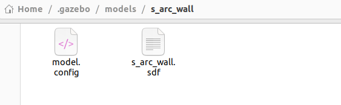
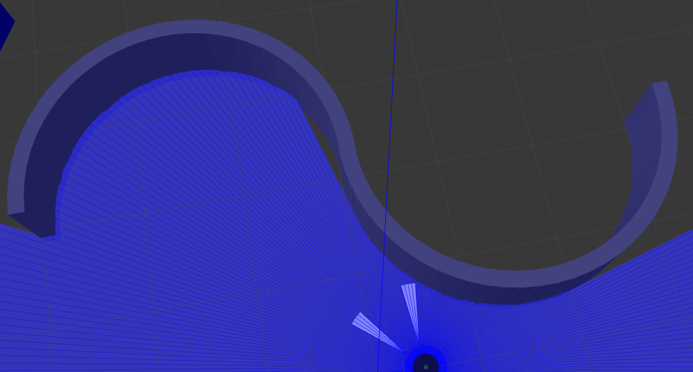

# how to use it
```
python3 generate_s_wall.py
```
It will generate a s_arcw_all.sdf file;

Create a new model folder~/. Gazebo/models/s_arc-wall/in Gazebo and place the generated. sdf file;

Add model.config file,like this:
```
<?xml version="1.0"?>
<model>
  <name>s_arc_wall</name>
  <version>1.0</version>
  <sdf version="1.6">s_arc_wall.sdf</sdf>
  <author>
    <name>Your Name</name>
    <email>your@email.com</email>
  </author>
  <description>
    A custom S-shaped wall composed of curved arc segments.
  </description>
</model>
```
like this:
  

Open Gazebo and use Insert to see the beautiful curved S-shaped wall:
  


